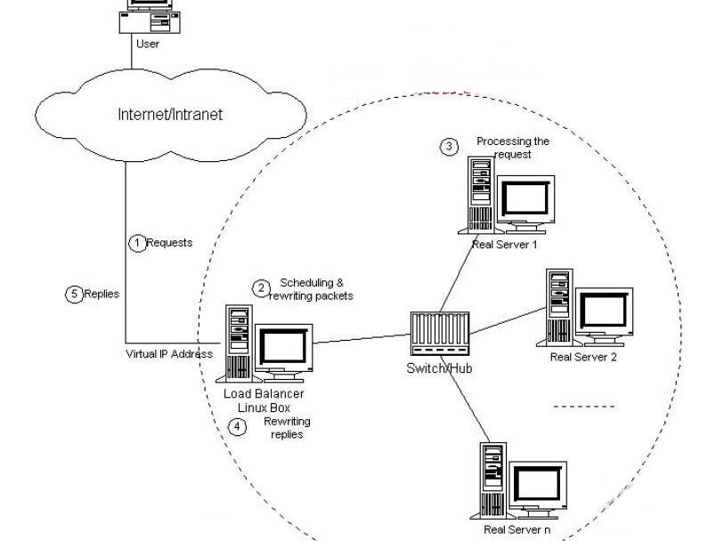
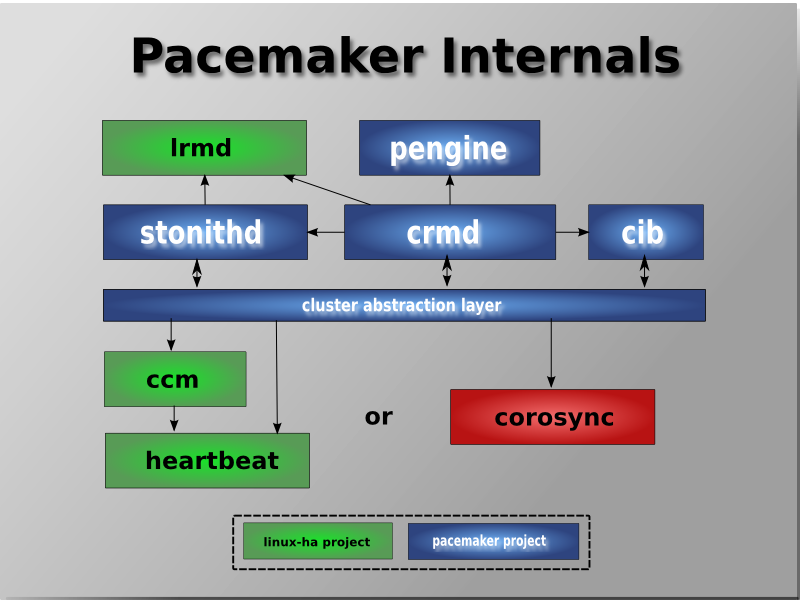

# Linux HA Introduction 

** Kai Kang <kai.kang@windriver.com> **

** Create date: Dec 09, 2014 **

** Last update: Dec 10, 2014 **

## 什么是集群？
集群是一组相互独立的、通过高速网络互联的计算机，它们构成了一个组，并以单一系统的模式加以管理。一个客户与集群相互作用时，集群像是一个独立的服务器。集群配置是用于提高可用性和可缩放性。

其目的是为了实现将多台计算机组合以来完成特定的任务，比如天气预报，大型网络游戏，这些都需要很大的运算量，单台计算机实现成本太高，而且不显示。那么就需要通过集群的方式，将废弃的或者正在使用的计算机联合起来，结合整体的力量来解决这些问题。

### 主要优点
- 高可扩展性：
- 高可用性：集群中的一个节点失效，它的任务可以传递给其他节点。可以有效防止单点失效。
- 高性能：负载平衡集群允许系统同时接入更多的用户。
- 高性价比：可以采用廉价的符合工业标准的硬件构造高性能的系统。

### 集群类型 
1. LB Load Balancing（负载均衡集群）
2. HA High Availability（高可用性集群）
3. HP High Performance（高性能集群）

#### 负载均衡集群
负载均衡集群为企业需求提供了更实用的系统。如名称所暗示的，该系统使负载可以在计算机集群中尽可能平均地分摊处理。该负载可能是需要均衡的应用程序处理负载或网络流量负载。这样的系统非常适合于运行同一组应用程序的大量用户。每个节点都可以处理一部分负载，并且可以在节点之间动态分配负载，以实现平衡。对于网络流量也是如此。通常，网络服务器应用程序接受了太多入网流量，以致无法迅速处理，这就需要将流量发送给在其它节点上运行的网络服务器应用。还可以根据每个节点上不同的可用资源或网络的特殊环境来进行优化。

##### 基本原理
用户通过互联网访问到某个网站时，前端的Load Balancer（类似负载均衡器）根据不同的算法或某种特定的方式，将请求转发到后端真正的服务器（节点），后台多台服务器共同分担整个网站的压力。后台的某个节点如果有宕机，其他节点也可以提供服务，从而维持整个网站的正常运行。

##### 实现方式：
- 硬件：负载均衡设备
- 软件：LVS(Linux Virtual Server), 中国的章文嵩博士发起和领导的

#### 高可用性集群
高可用集群，英文原文为High Availability Cluster，简称HA Cluster，是指以减少服务中断（如因服务器宕机等引起的服务中断）时间为目的的服务器集群技术。简单的说，集群（cluster）就是一组计算机，它们作为一个整体向用户提供一组网络资源。这些单个的计算机系统就是集群的节点（node）。

高可用集群的出现是为了使集群的整体服务尽可能可用，从而减少由计算机硬件和软件易错性所带来的损失。它通过保护用户的业务程序对外不间断提供的服务，把因软件/硬件/人为造成的故障对业务的影响降低到最小程度。如果某个节点失效，它的备援节点将在几秒钟的时间内接管它的职责。因此，对于用户而言，集群永远不会停机。高可用集群软件的主要作用就是实现故障检查和业务切换的自动化。

只有两个节点的高可用集群又称为双机热备，即使用两台服务器互相备份。当一台服务器出现故障时，可由另一台服务器承担服务任务，从而在不需要人工干预的情况下，自动保证系统能持续对外提供服务。双机热备只是高可用集群的一种，高可用集群系统更可以支持两个以上的节点，提供比双机热备更多、更高级的功能，更能满足用户不断出现的需求变化。

#### 高性能集群
这种集群一般企业或者个人很少应用到，高性能计算群集HPC。它可以解决世界上最为复杂和艰巨的计算难题，并且能够轻松处理。在气象建模、模拟撞车试验、人体基因绘图以及核爆炸模拟等多种与人类生命相关的重要领域都要用到HPC。

## 高可用性集群(HA)构建

Linux集群系统包括集群节点和集群管理器两部分。集群节点有时简称为节点、服务器或服务器节点，是提供处理资源的系统，它进行集群的实际工作。一般来讲，它必须进行配置才能成为集群的一部分，也必须运行集群的应用软件。应用软件可以是专用于集群的软件，也可以是设计用于分布式系统的标准软件。Linux集群管理器则是将节点捆绑在一起，以构成单一系统外观的逻辑结构，它用于将任务分解到所有的节点。

### Linux平台解决方案

#### 开放源代码的 HA 项目 
linux-HA 项目历史悠久, 项目主页http://www.linux-ha.org/。很多linux 发行附带的HA集群都是采用了linux-HA 的heartbeat系统和相关的组件。需要构建完全的开源，自由而且免费的高可用集群的用户可以选择。

#### RedHat公司的开放源代码RedHat Cluster Suite(RHCS)
- RHCS实际上是一个套件，除了现在提到的高可用集群软件，还包含了一个基于LVS的负载均衡软件.
- RHCS包含的集群软件，是GPL协议下开放源代码的集群系统. 
- RHCS是一个独立的产品，不包括在RedHat Enterprise Linux当中，无论是购买还是下载，都是单独存在的.（其实就是heartbeat的改进版，改个名，加入了些东西）

#### SuSE公司的开放源代码高可用集群HA套件

SuSE企业版Linux带有一套开放源代码的HA集群软件，包括HA project的heartbeat, heartbeat-ldirectord, heartbeat-pils, heartbeat-stonith, 集群关联的存储软件drbd, 虚拟IP的 src_vipa软件。和RHCS不同的是，SuSE/Novell 企业版Linux自带的HA集群软件并非一个独立的软件，如上介绍，而是由不同的开放源代码项目提供的不同部分的程序。

#### Novell 公司的Novell Cluster Service

Novell收购SuSE之后，将Novell netware上的Novell Cluster Service整合移植到了Linux平台。Novell Cluster Service是一个商业系统，并非开放源代码产品。细节可以参考[Novell Open Enterprise Server 2](http://www.novell.com/products/openenterpriseserver/ncs.html)。

### 以linux-HA构建高可用集群

***
#### linux-HA架构 **FIXME**

两种方式构建linux-ha
- pacemaker + corosync

***
- pacemaker + heartbeat
***

##### pacemaker
集群资源管理器（crm）

##### corosync
##### 由来
要说明corosync的由来，首先我们得从AIS说起，然后说明OpenAIS，最后才会说到corosync。

  应用接口规范（AIS）是用来定义应用程序接口（API）的开放性规范的集合，这些应用程序作为中间件为应用服务提供一种开放、高移植性的程序接口。是在实现高可用应用过程中是亟需的。服务可用性论坛（SA Forum）是一个开放性论坛，它开发并发布这些免费规范。使用AIS规范的应用程序接口（API），可以减少应用程序的复杂性和缩短应用程序的开发时间，这些规范的主要目的就是为了提高中间组件可移植性和应用程序的高可用性。SAF AIS是一个开放性工程，在不断更新中。

  OpenAIS是基于SA Forum标准的集群框架的应用程序接口规范。OpenAIS提供一种集群模式，这个模式包括集群框架，集群成员管理，通信方式，集群监测等，能够为集群软件或工具提供满足 AIS标准的集群接口，但是它没有集群资源管理功能，不能独立形成一个集群。OpenAIS组件包括AMF,CLM,CKPT,EVT,LCK,MSG，TMR,CPG,EVS等，因OpenAIS分支不同，组件略有不同。

  OpenAIS主要包含三个分支：Picacho，Whitetank，Wilson。Wilson是最新的，比较稳定的版本是从openais 1.0.0到openais 1.1.4。Whitetank现在是主流分支版本，比较稳定的版本是openais0.80到openais0.86。Picacho第一代的OpenAIS的分支，比较稳定的版本是openais0.70和openais0.71。现在比较常用的是Whitetank和Wilson，两者之间有很多不同。OpenAIS从Whitetank升级到Wilson版本后，组件变化很大，Wilson把Openais核心架构组件独立出来放在Corosync（Corosync是一个集群管理引擎）里面。Whitetank包含的组件有AMF，CLM，CKPT，EVT，LCK ,MSG, CPG，CFG,EVS, aisparser, VSF_ykd，bojdb等。而Wilson只含有AMF，CLM，CKPT，LCK, MSG,EVT,TMR（TMR，Whitetank里面没有），这些都是AIS组件。其他核心组件被放到了Corosync内。Wilson被当做Corosync的一个插件。(详细请查看官方文档)

  Corosync是OpenAIS发展到Wilson版本后衍生出来的开放性集群引擎工程。可以说Corosync是OpenAIS工程的一部分。OpenAIS从openais0.90开始独立成两部分，一个是Corosync；另一个是AIS标准接口Wilson。Corosync包含OpenAIS的核心框架用来对Wilson的标准接口的使用、管理。它为商用的或开源性的集群提供集群执行框架。Corosync执行高可用应用程序的通信组系统，它有以下特征：

- 一个封闭的程序组（A closed process group communication model）通信模式，这个模式提供一种虚拟的同步方式来保证能够复制服务器的状态。
- 一个简单可用性管理组件（A simple availability manager），这个管理组件可以重新启动应用程序的进程当它失败后。
- 一个配置和内存数据的统计（A configuration and statistics in-memory database），内存数据能够被设置，回复，接受通知的更改信息。
- 一个定额的系统（A quorum  syste）,定额完成或者丢失时通知应用程序。

从上图中我们可以看到，不管heartbeat，还是corosync都是高可用集群中的Cluster Messaging Layer（集群信息层），是主要传递发集群信息与心跳信息的，并没有资源管理功能，资源管理还得依赖于上层的crm(Cluster resource Manager，集群资源管理器)，最著名的资源管理器，就是pacemaker，它是heartbeat v3分离出去的子项目。而现在corosync+pacemaker成了高可用集群中的最佳组合。

心跳线会定期在各个节点间交换数据消息，在指定的周期内备份节点没有接收到心跳信息，那么将进行故障转移由备用节点接管群集，对外提供服务 。

##### Steps to build an HA
We use 2 virtual machines as our cluster nodes. Ubuntu 12.04 is the primary node,
Fedora 21 is the secondary node.

primary node:
	hostname: ha1-ubuntu
	IP: 128.224.163.169

secondary node:
	hostname: ha2-f21
	IP: 128.224.163.191

###### 各节点之间主机名互相解析
On ha1-ubuntu:
root@ha1-ubuntu:~# echo "128.224.163.169 ha1-ubuntu ha1-ubuntu" >> /etc/hosts
root@ha1-ubuntu:~# echo "128.224.163.191 ha2-f21 ha2-f21" >> /etc/hosts

On ha2-f21:
***FIXME***

###### 同步时间
    # ntpdate cn.pool.ntp.org

###### ssh互通

corosync:
2 versions
1.x
2.3.

corosync: from openais 0.9
pacemaker: heartbeat3's crm

什么叫做心跳

#### 实例
***

